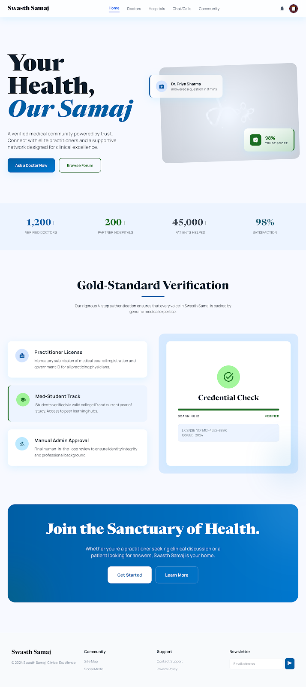
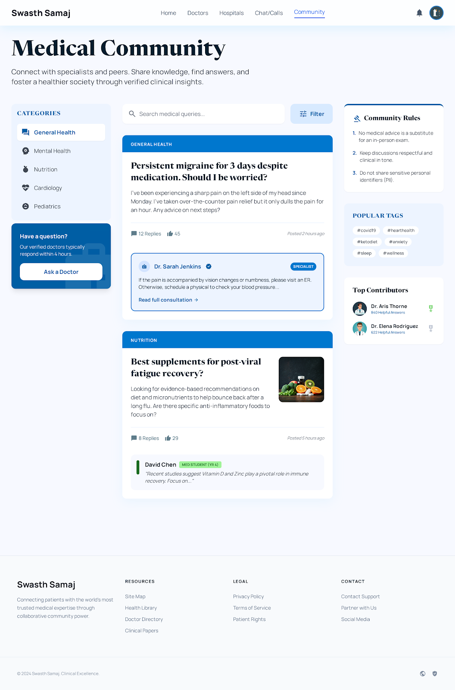
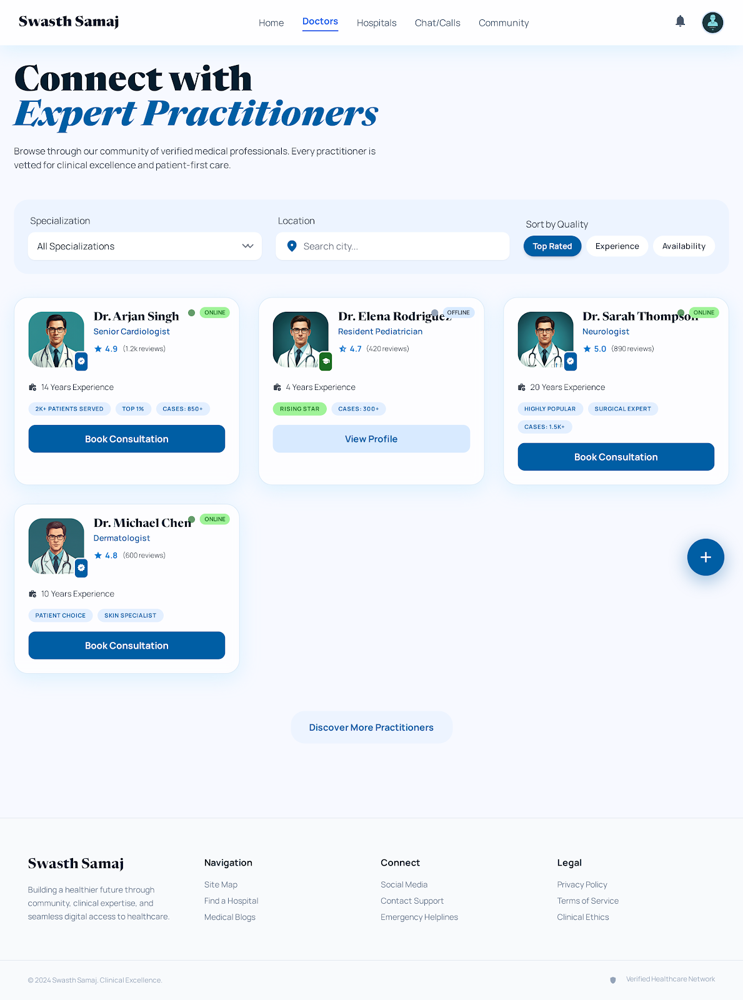
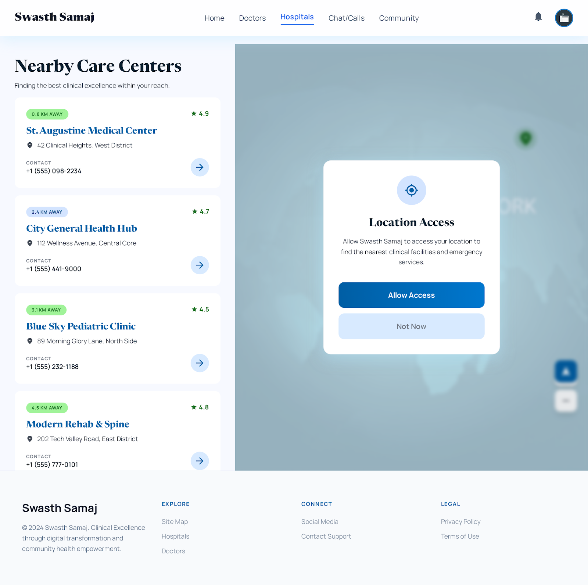

Swasth Samaj is a web-based platform where users can ask health-related questions and receive responses only from verified doctors and medical students.
All answers are moderated before being published, ensuring reliability and reducing misinformation.
The platform focuses on structured interaction, verified contributors, and basic access to healthcare resources.

System Overview
The platform works with three main roles:
User – asks questions and explores content
Doctor / Medical Student – answers questions after verification
Admin – verifies users and moderates answers

Core Functional Modules
1. Medical Forum
Users can:
Post questions with title, category, and description
Option to hide identity
(Planned) voice input support
Forum features:
Questions categorized by specialization
Status shown (answered / unanswered)
Only verified professionals can respond

2. Answer & Moderation System
Answers are submitted by verified users only
Each answer goes through:
Pending → Approved / Rejected
Only approved answers are visible
Verified responses are prioritized

3. Doctor & Student System
Doctor Features
Dedicated space (“Doctor Lounge”) for:
Awareness posts
Research or health-related content
Search and discovery:
Search by name or specialization
(Planned) filter by rating
Doctor profile includes:
Specialization
Experience
Credentials

Verification Process
Doctors
Basic details (name, email, phone)
Professional details (registration number, hospital, specialization, experience)
Document upload (certificate + ID proof)
Verified by admin (approx. 2–3 days)
Medical Students
Student ID, college, course, year
ID card upload
Verified by admin

4. Healthcare Access
Nearby hospitals using location
Shows:
Nearby facilities
Distance-based results
(Planned) sorting and specialization details

5. Additional Features
Notifications
Notification system with:
All notifications
Unread filter
User Profile
Basic personal information:
Name, email, phone
Age, gender, blood group
Bio
Blood SOS (Planned)
Users can:
Request blood
Register as donor
Support & Help
FAQ section
Email-based support
(Planned) ticket tracking system
Chatbot (Basic)
Handles general platform-related queries

  <i>Click on any image to view the high-resolution wireframe.</i>

| **Home / Dashboard** | **Verified Q&A Forum** |
| :---: | :---: |
|  |  |
| **Doctor Connect** | **Hospital Locator** |
|  |  |

How to Run the Project
(If there are any specific steps or dependencies to run your project locally, please list them here or add them in your README file on GitHub.)
*
WHEN STARTING BACKEND (LINUX/MAC) USE THIS COMMANDS
python3 -m pip install -r requirements.txt
cd Swaasth_samaj/backend_django
python3 -m venv venv
source venv/bin/activate
python3 -m pip install --upgrade pip
python3 -m pip install -r requirements.txt
python3 manage.py runserver 5000

WHEN STARTING FRONTEND(LINUX/MAC) USE THIS COMMANDS
go to frontend folder
cd Swaasth_samaj/frontend
# install dependencies
npm install
# start the app
npm run dev

WHEN STARTING BACKEND (WINDOWS) USE THIS COMMANDS
# go to backend folder
cd Swaasth_samaj\backend_django
# create virtual environment
python -m venv venv
# activate it
.\venv\Scripts\Activate.ps1
# upgrade pip
python -m pip install --upgrade pip
# install dependencies from requirements.txt
python -m pip install -r requirements.txt
# run server
python manage.py runserver 5000

WHEN STARTING FRONTEND(WINDOWS) USE THIS COMMANDS
# go to frontend folder
cd Swaasth_samaj\frontend
# install dependencies
npm install
# start the app
npm run dev
